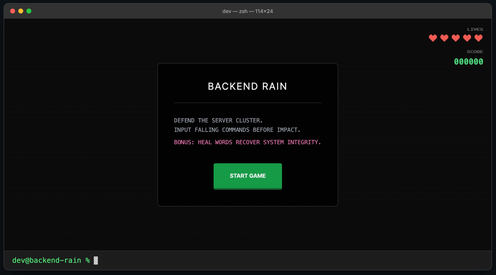
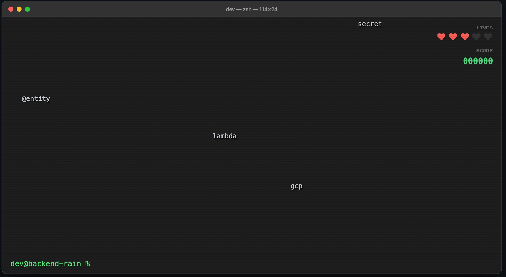

## 💻 1. 유틸리티 앱

  
  

### 앱 이름

WoowaLog

### 배포 링크

https://gemini.google.com/share/d23bd7a160f5

### 이 앱을 만든 이유

우아한테크코스 과정에서는 공식 일정과 개인 학습 일정이 동시에 존재하여 관리가 복잡해지는 문제가 있습니다. 기존 캘린더는 공식 일정과 개인 일정을 통합하기 어렵고, 체크리스트 앱은 시간 단위 스케줄링이 제한적이라는 한계가 있었습니다.
이러한 불편함을 해결하기 위해 공식 일정을 배경처럼 고정하고, 그 사이에 개인 학습 시간을 직관적으로 배치할 수 있는 전용 플래너를 제작했습니다.
본 앱은 우테코 전체 기간 동안 매일 사용하도록 설계되었으며, 사용자는 날짜별 진행 상황을 확인하고 개인 목표와 일정을 체계적으로 관리할 수 있습니다.

### 주요 기능

- **공식 일정 자동 동기화**

  공개 캘린더를 기반으로 주요 일정을 불러와 시각적으로 구분하여 표시합니다.

- **드래그 기반 스케줄링**

  마우스 드래그만으로 30분 단위 일정을 직관적으로 추가할 수 있습니다.

- **날짜별 목표 및 체크리스트 관리**

  특정 날짜를 선택하여 독립적인 목표와 할 일을 관리할 수 있습니다.

- **클라우드 데이터 저장**

  Firebase를 활용해 별도 로그인 없이 데이터가 지속적으로 유지됩니다.

---

## 🎮 2. 게임

  
  

### 앱 이름

Backend Rain

### 배포 링크

https://gemini.google.com/share/4d1604f9f34a

### 이 앱을 만든 이유

백엔드 개발자가 실무에서 자주 사용하는 기술 스택과 용어를 게임 형태로 자연스럽게 익힐 수 있도록 하기 위해 제작했습니다. 고전적인 산성비 게임 방식에 개발 용어를 결합하여, 입문자에게는 용어에 대한 친숙함을 높이고 숙련자에게는 빠르고 정확한 타이핑 능력을 점검할 수 있도록 했습니다.
개발 중 집중력이 떨어지는 순간 가볍게 즐길 수 있는 리프레시 도구이자, 팀 단위에서 아이스브레이킹 게임으로도 활용할 수 있도록 기획했습니다.

### 주요 기능

- **백엔드 특화 키워드 시스템**

  Java, Spring, Docker, Kubernetes, SQL, Cloud 등 100개 이상의 실무 용어를 기반으로 단어를 생성합니다.

- **점진적 난이도 가속 로직**

  단어를 맞출수록 낙하 속도와 생성 주기가 점점 빨라져 난이도가 자연스럽게 상승합니다.

- **생명력 및 힐링 시스템**

  기본 생명력 5개를 제공하며, 특정 보너스 단어 입력 시 생명력을 회복할 수 있습니다. 일반 단어는 실패 시 패널티가 적용되지만, 보너스 단어는 패널티 없이 지나갑니다.

- **실시간 텍스트 매칭 엔진**

  입력 중인 텍스트와 화면의 단어를 실시간으로 비교하여 즉각적인 판별이 이루어집니다.

- **동적 점수 계산 시스템**

  단어 길이와 현재 난이도를 반영하여 점수를 계산합니다.

- **결과 리포트**

  일정 횟수 이상 실패 시 게임이 종료되며 최종 점수를 제공합니다.

---

## 📚 3. 학습 앱

  
  

### 앱 이름

Spring Quize

### 배포 링크

https://gemini.google.com/share/c5b1b377d4dc

### 이 앱을 만든 이유

백엔드 개발자에게 매우 중요하지만, 단순한 텍스트 학습만으로는 실제 동작 원리를 정확히 이해하거나 오래 기억하기 어려운 개념들을 퀴즈 형식의 사이트를 통해 학습자가 자신의 이해도를 즉각적으로 점검할 수 있도록 하였습니다.
이 앱은 기술 면접을 준비할 때 핵심 개념을 빠르게 복습하는 용도로 활용할 수 있으며, 이론 학습 직후 이해도를 확인하는 자가 진단 도구로도 사용할 수 있습니다. 
또한 스터디 환경에서는 타임어택 기능을 활용해 게임처럼 즐기며 학습할 수 있도록 설계되었습니다.

### 주요 기능

- **15문항의 백엔드 핵심 개념 퀴즈**

  Notion 학습 자료와 최신 백엔드 트렌드를 기반으로 Spring MVC, Spring Data JPA, JWT, DTO, JDBC 흐름 등 핵심 개념을 포함한 15개의 문제를 제공합니다.

- **30초 타임어택 및 실시간 피드백**

  각 문제마다 30초의 제한 시간을 부여하여 실제 시험과 유사한 긴장감을 제공하며, 답안을 선택하는 즉시 정답 여부와 함께 상세한 해설을 제공하여 학습 효과를 높였습니다.

---

## 🤝 4. 페어 프롬프트 릴레이 앱

  
  

### 앱 이름

테코메이트

### 페어

@pairId

### 배포 링크

https://gemini.google.com/share/d21b84ef7372

### 이 앱을 만든 이유

페어 프로그래밍을 진행할 때 드라이버와 네비게이터의 역할을 잊거나 교체 시점을 놓치는 경우가 많습니다. 
테코메이트는 정해진 시간에 맞춰 명확한 알림을 주고, 참여 인원 간의 순서를 체계적으로 관리하여 개발 협업의 몰입도를 높이기 위해 제작되었습니다.

### 주요 기능

- **인원 관리 시스템**

  최소 2명에서 최대 3명까지 직관적으로 참여자를 관리할 수 있습니다.

- **자동 역할 순환**

  드라이버와 네비게이터 역할이 버튼을 통해 자동으로 순환됩니다.

- **커스텀 타이머 설정**

  상황에 맞게 역할 교체 시간을 설정할 수 있습니다.

- **알림 시스템**

  시각 및 청각 알림을 통해 교체 시점을 명확하게 전달합니다. 종료 시간 1분 전과, 종료 시간에 알림이 울립니다.

### AI 기능

- 어떤 AI 기능을 추가했나요?

  Gemini 2.5 Flash TTS를 활용하여 역할 교체 1분 전에 음성 안내를 제공하는 기능을 구현했습니다.

**AI 기능이 앱에서 어떤 역할을 하나요?**

- **작업 마무리 가이드**: 타이머 종료 1분 전에 AI가 "역할 교체 1분 전입니다. 작업을 마무리해 주세요."라고 음성으로 안내합니다.
- **몰입 방해 최소화**: 시각적인 확인을 위해 고개를 돌릴 필요 없이 음성만으로 남은 시간을 인지하게 하여, 개발자가 현재 작성 중인 코드의 흐름을 끊지 않고 자연스럽게 교체를 준비할 수 있도록 돕습니다.
- **최적화된 경험**: 앱 실행 시 음성을 미리 생성(캐싱)하여 네트워크 지연 없이 정확한 타이밍에 고품질의 AI 보이스를 제공합니다.
